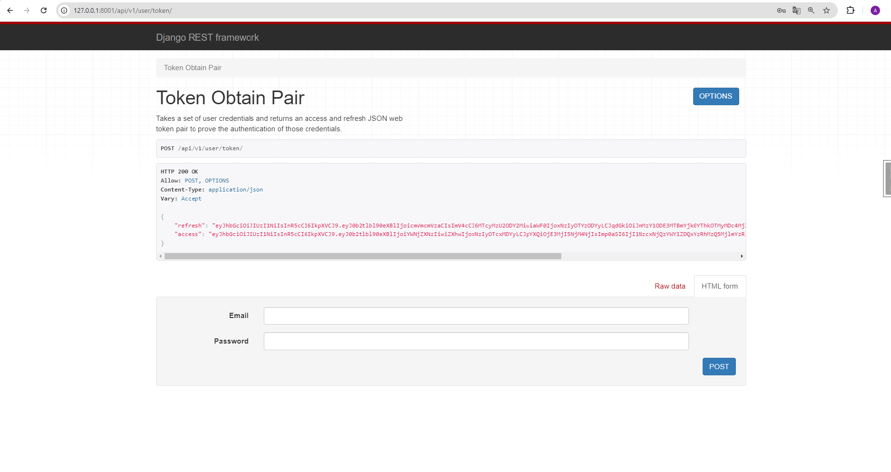

"# train-station-service"

API service for ticket train management system written on DRF,
in which Users can create account for choose and buy tickets for train.
The structure od database you can see: 
[db_structure_train_station_service.jpg](db_structure_train_station_service.jpg)


## Installing / Getting started

Python3 must be already installed
Docker must be already installed and running

```shell
git clone https://github.com/Anton-Konyk/train-station-service/
cd train_station_service
Python3 -n venv venv
source venv/bin/activate (for MacOS/Linux) or venv/scripts/activate (for Windows)
pip install -r requirenents.txt
create .env file (see example: [example.env](example.env) )
docker-compose build
docker-compose up
http://127.0.0.1:8001/api/v1/doc/swagger/  # API documentation
http://127.0.0.1:8001/api/v1/doc/redoc/  # API documentation

If you need create superuser account:
# After docker-compose up
docker ps
docker exec -it <CONTAINER ID for train_station_service-station> bash 
# example: docker exec -it d8ccc75eff0d bash
python manage.py createsuperuser
# after creating superuser
exit

If you need load database testing:
# After docker-compose up
docker ps
docker exec -it <CONTAINER ID for train_station_service-station> bash 
# example: docker exec -it d8ccc75eff0d bash
python manage.py loaddata train_station_service_db_data.json
exit
```

## Features

* JWT authentication functionality for User (email and password for first registration)
*  [getting_token.png](getting_token.png)
* Service has permissions: Is Admin Or If Authenticated Read Only
* Managing Crew, Facility, Train Types with image, Train, Station, Route, Order and Ticket by API
* App has filters for source and destination stations, for train facilities
* App gives information about capacity of train and quantity tickets for sale 
* Powerful admin panel for advanced management 


## Contributing

It's open source code.
If you'd like to contribute, please fork the repository and use a feature
branch. Pull requests are warmly welcome.


## Demo


!
